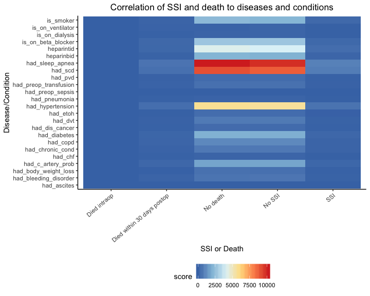

<link href="./styles.css" rel="stylesheet"></link> 

```{r load_packages, message=FALSE, warning=FALSE, include=FALSE} 
library(fontawesome)
```

## About our project
We want to investigate contributing factors of the risk of post-operative complication using a dataset on colectomy surgeries performed 2014 - 2016 from multiple hospitals in Michigan. In addition, we created an application that enables interested users to use a subset of the data to create their own models, based on variables that they might find useful or that we may have not considered.    
           
Our full report can be found  [here](https://github.com/thecbp/P8105_final/blob/master/report.md). 
    
## Data and methods
The raw data contains 10868 rows and 992 columns. Each row corresponds to a single colectomy and an incredible amount of information, including a bevy of laboratory, disease, surgery and patient data.     
      
To figure out which variables have an impact on post-surgery complication, we performed a regression analysis. We are using surgery site infection as our outcome of interest, as infection is the most common type of complication. With our literature review, we’ve decided to start with a subset of 20 variables. These candidate variables have been shown to be associated with SSI, so we’ll use automatic procedures to further cut down on covariates and get to a more robust, parsimonious model.
       
      
## Exploratory Analysis

#### Insurance status
One variable we thought would have a relationship to SSI was a patient's insurance status. We believed that patients with little to no coverage would be forced to go to less experienced hospitals and experience more SSI.    
<div id="main" style="margin:left; width:380px;display:block" />

</div>
There is generally no distinction between the insurance types, with most of the percentages hovering between 6 to 12 percent. Noticeably, patients with private insurance had a much higher percentage of SSIs at above 25 percent while patients with other insurance had 0 percent. However, this is most likely due to the small sample size of patients with those types of insurance and should not affect our conclusions.
     
In the end, our hypotheses was incorrect; there was seemingly no relationship between insurance type and occurence of SSIs. This result indicates it would be a poor candidate for predicting SSI.

#### Prior health conditions

To see how often a condition is related to SSI, we used a heatmap to see if any are particularly associated with SSI. We also looked at death as an outcome to see if any of these diseases are associated with it.    
<div id="main" style="margin:left; width:380px;display:block" />

</div>
Comparing number of death and SSI cases side by side with each health condition, we see a nearly symmetric heatmap. There are fewer cases under patients that actually got SSI or died from the operation, so it is difficult to conclude any direct relationship between health condition and surgery outcome. Intrestingly, we can see that there are a great number of successful cases for patients with sleep apnea, specific carbohydrate diet, and hypertension related ot SSI.    

#### Surgical time
    
We'll look at the distribution of surgery times in the dataset to see if there's any outliers. Most of the surgeries last around 250 minutes, but we can see that there is a heavy tail on the right. 
<div id="main" style="margin:left; width:380px;display:block" />

</div>
Although there are some SSI-related surgeries that look to take longer than non-SSI colectomies, both follow a similar distribution. Thus, we cannot definitively say that the surgery time can help differentiate between SSI cases and non-SSI cases based on the plot.  

## Discussion
Our stepwise regression provided us with 23 covariates, with length of stay, surgical approaches 2, 3, and 4, age, ASA level 3, admission to ICU, surgery time, and BMI statistically significant.    
    
We are pleased to see that many of the variables that we found during our literature found themselves in the model and were statistically significant. However, many of the variables that were found to be risk factors in SSI did not end up in the final model or were not statistically significant.    
      
Although far from perfect, our model gives us some insight into what pre-surgical disease/traits contribute to SSI and supports some of the research done on this particular subject. We believe that our results can be improved by starting with more parsimonious models and building the stepwise regression from there.    
